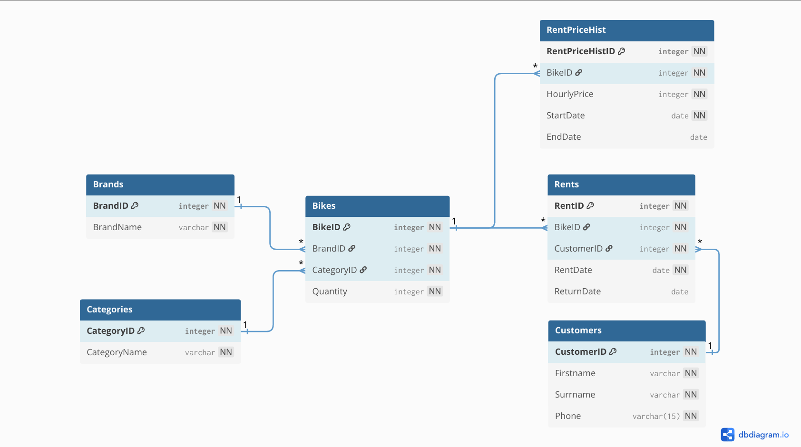

# Bike renting page

### Authors:

Krzysztof Patla, Szymon Potępa

#### Technologies used:

Backend: Java + Spring
Frontend: React + Vite + Tailwind

#### Database: MySQL

---

Aplikacja dla pracownika wypożyczalni rowerów.

Umożliwia ona zarządzanie magazynem rowerów (dodawanie, przeglądanie, zmiana cen , średnia cena wypożyczeń z danego czasu dla danego roweru), składanie rezerwacji, przeglądanie klientów i historycznych cen rowerów jak i historycznych wypożyczeń.

Oblicza ona na bieżąco aktualny koszt dla danego wypożyczenia i może obliczyć przychód wypożyczalni z zadanego czasu.

---

### Uruchamianie

aby pobrać wszystkie potrzebne pakiety trzeba uruchomić

`npm install`

aby pobrać bazę danych należy mieć pobranego Dockera i uruchomić komendy

`cd 'ścieżka do projektu'/docker`
`docker-compose up -d`

kontener powinien się uruchomić samodzielnie

aby uruchomić backend należy wpisać w terminalu

`cd 'ścieżka do projektu'/project/backend/bike-rent-potepa-patla`
`./gradlew bootRun` lub `gradlew.bat bootRun`

(gdy pasek naładuje się do 80%, oznacza to że baza danych zaczęła działać)

aby uruchomić frontend projektu należy wpisać w terminalu

`cd 'ścieżka do projektu'/project/frontend`
`npm run dev`

oraz wpisać
`o`
lub uruchomić localhosta wypisanego przez terminal (można też nacisnąć link)

---

### Baza danych ma następującą strukturę



### Warunki integralnościowe dla poszczególnych tabel:

#### Bikes:

- fk_bikes_brand

```js
ALTER TABLE Bikes ADD CONSTRAINT fk_bikes_brand FOREIGN KEY (BrandID) REFERENCES Brands(BrandID),
```

- fk_bikes_category

```js
ALTER TABLE Bikes ADD CONSTRAINT fk_bikes_category FOREIGN KEY (CategoryID) REFERENCES Categories(CategoryID);
```

- chk_quantity_non_negative

```js
ALTER TABLE Bikes ADD CONSTRAINT chk_quantity_non_negative CHECK (Quantity >= 0);
```

#### Brands:

- uk_brand_name

```js
ALTER TABLE Brands ADD CONSTRAINT uk_brand_name UNIQUE (BrandName)
```

#### Categories:

- uk_category_name

```js
ALTER TABLE Categories ADD CONSTRAINT uk_category_name UNIQUE (CategoryName);
```

#### Customers:

- uk_customer_phone

```js
ALTER TABLE Customers ADD CONSTRAINT uk_customer_phone UNIQUE (Phone);
```

#### RentPriceHist:

- fk_rentprice_bike

```js
ALTER TABLE RentPriceHist ADD CONSTRAINT fk_rentprice_bike FOREIGN KEY (BikeID) REFERENCES Bikes(BikeID)
```

- chk_hourly_price_positive

```js
ALTER TABLE RentPriceHist ADD CONSTRAINT chk_hourly_price_positive CHECK (HourlyPrice > 0);
```

### Trigger dla tabeli Rents:

- AddRent_tr

```js
create definer = avnadmin@`%` trigger AddRent_tr
    before insert
    on Rents
    for each row
BEGIN
    DECLARE rents_count integer default 0;
    DECLARE current_quantity integer default 0;
    DECLARE row_lock integer;


    SELECT 1 INTO row_lock FROM Customers WHERE CustomerID = NEW.CustomerID FOR UPDATE;

    SELECT COUNT(*) INTO rents_count FROM Rents WHERE CustomerID = NEW.CustomerID AND ReturnDate IS NULL;
    IF rents_count >= 5 THEN
        SIGNAL SQLSTATE '45000'
        SET MESSAGE_TEXT = 'Nie mozna dodac rezerwacji, poniewaz klient ma juz 5 rezerwacji';
    END IF;


    SELECT Quantity INTO current_quantity FROM Bikes WHERE BikeID = NEW.BikeID FOR UPDATE;

    IF current_quantity = 0 THEN
        SIGNAL SQLSTATE '45000'
        SET MESSAGE_TEXT ='Roweru o podanym BikeID nie ma obecnie na stanie.';
    END IF;
END;


```

### Funkcje:

- AvgBikeRentPrice_f

```js
create function AvgBikeRentPrice_f(bikeId_v int, startDate_v datetime, endDate_v datetime) returns decimal(10, 2)
    reads sql data
BEGIN
    DECLARE avgPrice decimal(10,2);

    IF endDate_v < startDate_v THEN
        SIGNAL SQLSTATE '45000'
        SET MESSAGE_TEXT ='Data koncowa musi byc pozniejsza od startowej';
    END IF;


    SELECT AVG(HourlyPrice) INTO avgPrice
    FROM RentPriceHist
    WHERE BikeID = bikeId_v
      AND StartDate <= endDate_v
      AND (EndDate >= startDate_v OR EndDate IS NULL);

    IF avgPrice IS NULL THEN
        SIGNAL SQLSTATE '45000'
        SET MESSAGE_TEXT ='Brak historii cen dla podanego roweru w wybranym okresie.';
    END IF;

    RETURN avgPrice;
END;
```

- Income_f

```js
create function Income_f(p_StartDate datetime, p_EndDate datetime) returns int
    reads sql data
BEGIN
    DECLARE price integer;

    SELECT COALESCE(SUM(RentalPrice_f(RentID)), 0) INTO price FROM Rents
    WHERE RentDate BETWEEN p_StartDate AND p_EndDate;

    RETURN price;
END;
```

- RentalPrice_f

```js
create function RentalPrice_f(p_RentID int) returns int
    reads sql data
BEGIN
    DECLARE v_hourly_price INT;
    DECLARE v_rent_date DATETIME;
    DECLARE v_return_date DATETIME;
    DECLARE v_total_hours INT;

    SELECT  r.RentDate, r.ReturnDate, p.HourlyPrice INTO v_rent_date, v_return_date, v_hourly_price
    FROM Rents r
    INNER JOIN RentPriceHist p ON r.BikeID = p.BikeID
    WHERE r.RentID = p_RentID
      AND p.StartDate <= r.RentDate
      AND (p.EndDate >= r.RentDate OR p.EndDate IS NULL)
    LIMIT 1;

    SET v_total_hours = GREATEST(1, CEIL(TIMESTAMPDIFF(MINUTE, v_rent_date, IFNULL(v_return_date, NOW())) / 60.0));

    RETURN v_total_hours * v_hourly_price;
END;
```

### Procedury:

- AddBike_p

```js
create procedure AddBike_p(IN brandId_v int, IN categoryId_v int, IN hourly_price_v int,
                                               OUT bikeId_v int)
BEGIN
     INSERT INTO Bikes(brandid, categoryid, quantity)
     VALUES (brandId_v, categoryId_v, 0);

     SET bikeId_v = LAST_INSERT_ID();


     INSERT INTO RentPriceHist(BikeID, HourlyPrice, StartDate, EndDate)
     VALUES(bikeId_v, hourly_price_v, CURRENT_DATE(), NULL);
END;
```

- AddBrand_p

```js
create procedure AddBrand_p(IN brandName_v varchar(255), OUT brandId_v int)
BEGIN
    INSERT INTO Brands (BrandName)
VALUES (brandName_v);
    SET brandId_v=LAST_INSERT_ID();
END;
```

- AddCategory_p

```js
create procedure AddCategory_p(IN categoryName_v varchar(255), OUT categoryId_v int)
BEGIN
    INSERT INTO Categories (CategoryName)
VALUES (categoryName_v);
    SET categoryId_v=LAST_INSERT_ID();
END;
```

- AddCustomer_p

```js
create procedure AddCustomer_p(IN firstname_v varchar(255), IN surrname_v varchar(255),
                                                   IN phone_v varchar(16), OUT customerId_v int)
BEGIN
    INSERT INTO Customers(firstname, surrname,phone) VALUES(firstname_v,surrname_v,phone_v);
    SET customerId_v=LAST_INSERT_ID();
END;
```

- AddQuantity_p

```js
create procedure AddQuantity_p(IN quantity_v int, IN bikeID_v int)
BEGIN
    UPDATE Bikes
    SET Quantity = Quantity + quantity_v
    WHERE BikeID = bikeID_v;

    IF ROW_COUNT() = 0 THEN
        SIGNAL SQLSTATE '45000'
        SET MESSAGE_TEXT = 'Nie ma takiego BikeID';
    END IF;
END;
```

- AddRent_p

```js
create procedure AddRent_p(IN bike_id_v int, IN customer_id_v int, OUT rentId_v int)
BEGIN
    INSERT INTO Rents(bikeid, customerid, rentdate, returndate)  VALUES(bike_id_v,customer_id_v,NOW(),NULL);
    SET rentId_v=LAST_INSERT_ID();
    CALL AddQuantity_p(-1,bike_id_v);
end;
```

- ChangeRentPrice_p

```js
create procedure ChangeRentPrice_p(IN bike_id_v int, IN hourly_price_v int, OUT rentPriceId_v int)
BEGIN
    UPDATE RentPriceHist
    SET EndDate = CURRENT_DATE()
    WHERE BikeID = bike_id_v AND EndDate IS NULL;

    INSERT INTO RentPriceHist(BikeID, HourlyPrice, StartDate, EndDate)
    VALUES (bike_id_v, hourly_price_v, CURRENT_DATE(), NULL);

    SET rentPriceId_v = LAST_INSERT_ID();
END;
```

- CurrentRentsForCustomer_p

```js
create procedure CurrentRentsForCustomer_p(IN customerId_v int)
BEGIN
    IF NOT EXISTS(SELECT 1 FROM Customers WHERE CustomerID=customerId_v) THEN
        SIGNAL SQLSTATE '45000'
        SET MESSAGE_TEXT ='Customer o podanym id nie istnieje.';
    end if;

    SELECT RentID,BikeID,RentDate,ReturnDate
    FROM Rents
    WHERE Rents.CustomerID=customerId_v;
end;
```

- EndRent_p

```js
create procedure EndRent_p(IN rent_id_v int)
BEGIN
    DECLARE v_bike_id INT;

    SELECT BikeID INTO v_bike_id
    FROM Rents
    WHERE RentID = rent_id_v;

    UPDATE Rents
    SET ReturnDate = NOW()
    WHERE RentID = rent_id_v AND ReturnDate IS NULL;

    IF ROW_COUNT() = 1 THEN
        CALL AddQuantity_p(1, v_bike_id);
    ELSE

        SIGNAL SQLSTATE '45000'
        SET MESSAGE_TEXT = 'To wypozyczenie zostalo zakonczone lub nie istnieje.';
    END IF;
END;
```

- FilterBike_p

```js
create procedure FilterBike_p(IN categoryName_v varchar(255), IN brandName_v varchar(255))
BEGIN
    SELECT Bikes.BikeID, Bikes.Quantity
    FROM Bikes
    INNER JOIN Brands ON Bikes.BrandID = Brands.BrandID
    INNER JOIN Categories ON Bikes.CategoryID = Categories.CategoryID
    WHERE Brands.BrandName LIKE CONCAT('%', brandName_v, '%')
      AND Categories.CategoryName LIKE CONCAT('%', categoryName_v, '%');
END;
```

- FilterCustomer_p

```js
create procedure FilterCustomer_p(IN customerPhone_v varchar(255))
BEGIN
    SELECT Firstname,Surrname,Phone
    FROM Customers
    WHERE Phone = customerPhone_v;
end;
```

### Widoki:

- view_active_rents

```js
CREATE VIEW view_active_rents AS
SELECT
    CONCAT(c.Firstname, ' ', c.Surrname) AS CustomerName,
    r.RentID,
    r.BikeID,
    b.BrandName,
    r.RentDate,
    RentalPrice_f(r.RentID)              AS RentPrice
FROM Rents r
    LEFT JOIN Customers c ON r.CustomerID = c.CustomerID
    LEFT JOIN Bikes bi    ON r.BikeID = bi.BikeID
    JOIN Brands b         ON bi.BrandID = b.BrandID
WHERE r.ReturnDate IS NULL
ORDER BY RentDate DESC
```

- view_hist_rents

```js
CREATE VIEW view_hist_rents AS
select RentID, Rents.BikeID,BrandName,Firstname,Surrname,RentDate,ReturnDate from Rents
INNER JOIN Customers
ON Rents.CustomerID = Customers.CustomerID
INNER JOIN Bikes
ON Rents.BikeID = Bikes.BikeID
INNER JOIN Brands
ON Bikes.BrandID=Brands.BrandID
WHERE ReturnDate IS NOT NULL
ORDER BY ReturnDate DESC
```

- view_bestsellers

```js
CREATE VIEW view_bestsellers AS
SELECT r.BikeID            AS BikeID,
       br.BrandName        AS Brand,
       c.CategoryName      AS Category,
       COUNT(r.RentID)     AS Rents
FROM Rents r
    JOIN Bikes bi ON r.BikeID = bi.BikeID
    JOIN Brands br ON bi.BrandID = br.BrandID
    JOIN Categories c ON bi.CategoryID = c.CategoryID
GROUP BY r.BikeID
ORDER BY COUNT(r.RentID) DESC
LIMIT 10
```

- view_brands

```js
CREATE VIEW view_brands AS
    SELECT * FROM Brands
ORDER BY BrandID DESC
```

- view_bestselling_brands

```js
CREATE VIEW view_bestselling_brands AS
SELECT br.BrandName        AS Brand,
       COUNT(r.RentID)     AS Rents
FROM Rents r
    JOIN Bikes bi ON r.BikeID = bi.BikeID
    JOIN Brands br ON bi.BrandID = br.BrandID
GROUP BY bi.BrandID
ORDER BY COUNT(r.RentID) DESC
LIMIT 2
```

- view_categories

```js
CREATE VIEW view_categories AS
    SELECT * FROM Categories
ORDER BY CategoryID DESC
```

- view_bike_stock

```js
CREATE VIEW view_bike_stock AS
SELECT bi.BikeID            AS BikeID,
       br.BrandName         AS Brand,
       c.CategoryName       AS Category,
       bi.Quantity          AS Quantity,
       (SELECT rph.HourlyPrice
        FROM RentPriceHist rph
        WHERE rph.BikeID = bi.BikeID
          AND rph.EndDate IS NULL)      AS HourlyPrice
FROM Bikes bi
    JOIN Brands br ON bi.BrandID = br.BrandID
    JOIN Categories c ON bi.CategoryID = c.CategoryID
ORDER BY bi.BikeID ASC
```

- view_hist_price

```js
CREATE VIEW view_hist_price AS
SELECT RentPriceHistID,Bikes.BikeID,BrandName,HourlyPrice,StartDate,EndDate FROM RentPriceHist
INNER JOIN Bikes
ON RentPriceHist.BikeID = Bikes.BikeID
INNER JOIN Brands
ON Bikes.BrandID = Brands.BrandID
WHERE EndDate IS NOT NULL
ORDER BY EndDate DESC
```

- view_most_rented_category

```js
CREATE VIEW view_most_rented_category AS
SELECT c.CategoryName       AS Category,
       COUNT(r.RentID)      AS Rents
FROM Rents r
    JOIN Bikes bi ON r.BikeID = bi.BikeID
    JOIN Categories c ON bi.CategoryID = c.CategoryID
GROUP BY bi.CategoryID
ORDER BY COUNT(r.RentID) DESC
LIMIT 1
```

- view_customers

```js
CREATE VIEW view_customers AS
    SELECT * FROM Customers
ORDER BY CustomerID DESC
```
